<!-- # FPGA与CPLD架构基础 -->

这一章主要对当前市场上可编程逻辑器件的架构进行了系统性的综述和讲解。
首先，我们定义了该领域的相关术语，并阐述了可编程逻辑器件近年来的发展历程。
随后，我们重点介绍复杂可编程逻辑器件（CPLDs）以及现场可编程门阵列（FPGAs）的基本架构。接下来，我们详细介绍了所有主流商用芯片的架构，并为每种类型的器件提供了实际应用案例。

## 基本概念

- **FPGA**（Field-Programmable Gate Array）  
  基于查找表（LUT）结构的可编程逻辑器件，支持高密度逻辑资源、复杂时序设计和大规模并行处理。

- **CPLD**（Complex Programmable Logic Device）  
  基于乘积项（Product-Term）结构的可编程逻辑器件，适合简单逻辑控制和组合电路设计。

---

## 可编程逻辑器件发展历史

### 可编程逻辑器件（FPDs）的发展与分类

#### 早期可编程逻辑器件

##### **Programmable Read-Only Memory (PROM)**:

- 这是第一种能够实现逻辑电路的用户可编程芯片。
- 地址线可用作逻辑电路输入，数据线可用作输出。
- 缺点:
  - 逻辑函数通常只需要较少的乘积项，而 PROM 的地址输入具有完整的译码器。
  - 这种架构在实现逻辑电路时效率较低，因此在实践中很少用于该目的。

---

##### **Field-Programmable Logic Array (FPLA) / PLA**:

- 这是后来专门为实现逻辑电路而设计的第一个器件。
- PLA 由两级逻辑门组成：
  - 可编程的“线与”与门平面。
  - 可编程的“线或”或门平面。
- 任何输入（或其补码）都可以在与门平面进行与操作，每个与门输出可以对应输入的任何乘积项。
- 每个或门输出可以配置为与门输出的逻辑和。
- 优点:
  - 非常适合实现积之和形式的逻辑函数。
  - 与门和或门都可以有多个输入，具有较高的灵活性。
- 缺点:
  - 制造成本高。
  - 速度性能较差，因为可编程逻辑平面难以制造且引入了显著的传播延迟。

---

##### **Programmable Array Logic (PAL)**:

- 为克服 PLA 的缺点，PAL 被开发出来。
- 结构:
  - 仅包含一个可编程的“线与”与门平面，后接固定的或门。
  - 为了弥补或门固定的局限性，产生了多种 PAL 变体，具有不同的输入输出数量和或门大小。
- 特点:
  - 通常包含连接到或门输出的触发器，以实现时序电路。
  - 对数字硬件设计产生了深远影响，并为更复杂的架构奠定了基础。

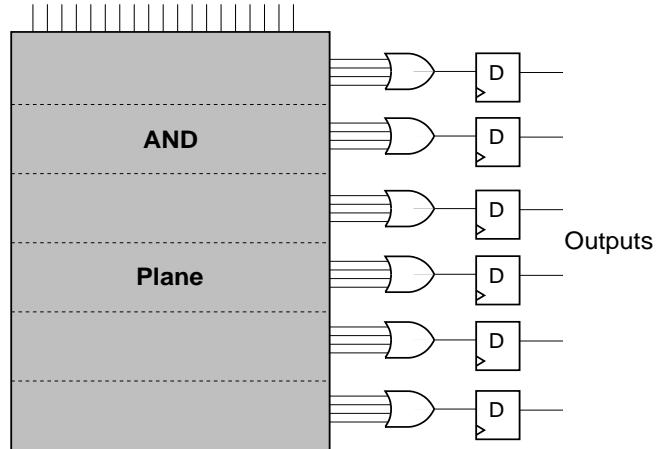  
**图1：PAL（可编程阵列逻辑）结构示意图**

---

#### 简单可编程逻辑器件（SPLDs）

- 包括 PLA、PAL 和类似 PAL 的器件。
- 主要特点:
  - 低成本。
  - 极高的引脚到引脚速度性能。

#### 复杂可编程逻辑器件（CPLDs）

- 随着技术进步，SPLD 的容量限制使得 CPLD 应运而生。
- 结构:
  - 将多个 SPLD 集成到单个芯片上，并通过可编程互连将它们连接起来。
- 发展:
  - 由 Altera 首创，推出 Classic EPLDs、MAX 5000、MAX 7000 和 MAX 9000 系列。
- 逻辑容量:
  - 相当于约 50 个典型 SPLD 器件，但难以扩展到更高密度。

---

#### 可编程门阵列（FPGAs）

1. **Mask-Programmable Gate Arrays (MPGAs)**:
   - 传统门阵列，由预制的晶体管阵列组成，通过定制金属互连实现用户逻辑电路。
   - 缺点:
     - 定制化涉及高昂的设置成本和较长的制造时间。

2. **Field-Programmable Gate Arrays (FPGAs)**:
   - 类似于 MPGA，但配置由最终用户通过编程完成。
   - 结构:
     - 由未指定的电路元件（称为逻辑块）和互连资源组成。
   - 优势:

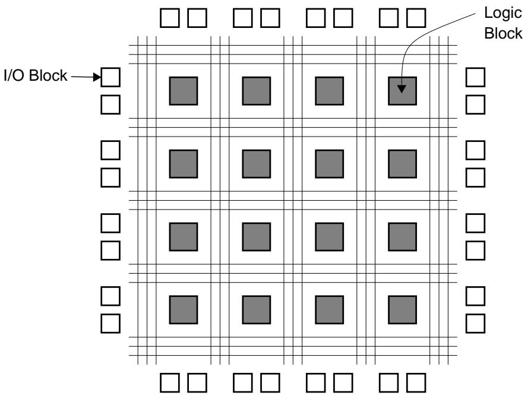
**图2：** *FPGA结构图.*

---

#### PLD 分类与逻辑容量

- **SPLDs**:
  - 容量最低，适合简单逻辑应用。
- **CPLDs**:
  - 中等容量，适合中等复杂度设计。
- **FPGAs**:
  - 最高容量，适合复杂逻辑设计。
- 选择依据:
  - 根据应用所需的逻辑容量。

---

#### 其他特殊用途器件

- 针对特定应用（如状态机、模拟门阵列、大规模互连问题）优化的器件。
- 由于应用范围有限，此处不做详述。

## 可编程逻辑器件典型工艺  

### 反熔丝技术概述

#### **起源与发展**

- 该项目由美国斯坦福大学发明。
- 第一种开发出来的用户可编程开关是 **熔丝**，广泛应用于可编程逻辑阵列（PLA）中。
- 由 **Actel** 公司开发，该公司后被 **Microsemi** 公司收购，而 **Microsemi** 公司又被 **Microchip** 公司收购。

#### **反熔丝基础特性**

- 在初始状态下是开路的。
- 只有在编程后才会呈现低电阻特性。
- 适用于FPGA，可通过改进的CMOS技术实现。

---

#### **技术实现**

- **PLICE结构**（由Actel公司开发）^[E. Hamdy et al, "Dielectric-based antifuse for logic and memory ICs," IEEE International Electron Devices Meeting Technical Digest, pp. 786 - 789, 1988.] :
  - 位于两条互连导线之间。
  - 由三层结构组成：
    - 顶层和底层为导体（多晶硅和n+扩散层）。
    - 中间层为绝缘体（ONO，氧化物-氮化物-氧化物）。
  - 未编程状态：绝缘体隔离顶层和底层。
  - 编程状态：绝缘体转变为低电阻连接。

- **其他反熔丝结构**^[J. Birkner et al, "A very-high-speed field-programmable gate array using metal-tometal antifuse programmable elements," Microelectronics Journal, v. 23, pp. 561-568]:
  - 采用金属作为导体。
  - 中间层为非晶硅。

---

#### PLICE反熔丝的特性与应用

- **尺寸与电气性能优势**:
  - 反熔丝足够小，可以适应通道布线轨迹的宽度，**PLICE** 反熔丝在尺寸和电气性能方面具有关键优势。
  - 这意味着反熔丝本身基本上不会产生芯片尺寸开销。

- **架构突破**:
  - **PLICE** 反熔丝的小尺寸和低延迟特性，使得 **Actel** 在以下两个关键架构上取得突破：
    - 提供丰富的布线资源，同时保持非常小的芯片尺寸。
    - 提供高度灵活、高度精细的架构（如小的逻辑块）。

- **一次性编程特性**:
  - 采用这种工艺的可编程逻辑器件（PLD）一旦编程后，其内部连接关系将永久固化，无法再修改。
  - 由于是一次性器件，一旦编程失败或设计出现缺陷，整个器件将报废，必须重新采购新的器件。
  - 这导致设计成本较高。

- **抗干扰与保密性能**:
  - 采用这种工艺的 PLD 具有优异的抗干扰性能和保密性能。
  - 由于整个设计已经被固化到芯片内，破解芯片内的设计结构异常困难。

---

### PROM、EPROM和EEPROM工艺

**可编程只读存储器**（**Programmable Read Only Memory**，**PROM**）是一种可编程逻辑器件。

**PROM** 内部由固定的逻辑与阵列和可编程的逻辑或阵列构成。

当使用 **PROM** 时，可以通过最小项求和的方式实现布尔逻辑函数功能

- 浮栅晶体管类似于 EPROM 和 EEPROM 中使用的晶体管。
- 在 CPLD 中，浮栅晶体管被用作可编程开关，并广泛应用于许多 SPLD 中。
- 实现方式:
  - 将晶体管放置在两条导线之间，以便实现线与（wired-AND）功能。
  - 示例:
    - 图3展示了 EPROM 晶体管在 CPLD 的与门平面中的连接方式。
    - 如果某个输入是相应乘积项的一部分，则该输入可以通过 EPROM 晶体管将与产品线驱逻辑电平“0”。
    - 对于不参与乘积项的输入，相应的 EPROM 晶体管被编程为永久关闭。
- EEPROM 器件的工作方式与此类似。

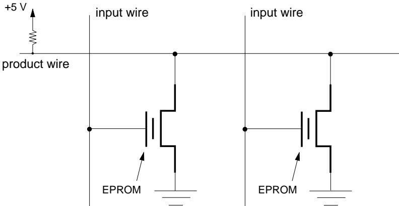

**图3：** *EPROM可编程开关结构图.*

---

#### SRAM

**Xilinx** 公司（被 **AMD** 公司收购）和 **Altera** 公司（被 **Intel** 公司收购）的绝大多数 **FPGA** 采用 **SRAM** 工艺。

- **SRAM 和反熔丝**:
  - 尽管 EPROM 或 EEPROM 技术理论上也适用于 FPGA，但目前商用 FPGA 产品主要基于 SRAM 或反熔丝技术。

- **SRAM 单元的应用**:
  - 用于控制传输晶体管（pass-transistor）开关的栅极节点。
  - 用于控制多路复用器（multiplexer）的选择线，从而驱动逻辑块输入。

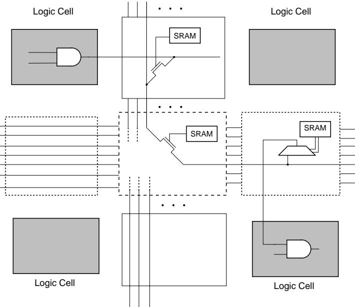

**图4：** *SRAM可编程开关.*

- **示例连接**:
  - 图5展示了一个逻辑块（由左上角的与门表示）通过两个传输晶体管开关和一个多路复用器连接到另一个逻辑块的过程。
  - 所有这些开关和多路复用器都由 SRAM 单元控制。

- **FPGA 的实现方式**:
  - FPGA 是否使用传输晶体管、多路复用器或两者结合，取决于具体产品的设计。

- 只读存储器（Read Only Memory，ROM）采用掩膜工艺，它属于非易失性存储器。
- 当系统断电后，信息仍然保留在 ROM 内的存储单元中。
  - 用户可以从掩膜器件中读取信息，但是不能往 ROM 中写入任何信息。
  - ROM 单元保存了行和列数据，形成一个阵列，每一列有负载电阻使其保持逻辑 1，每个行列的交叉有一个关联晶体管和一个掩膜连接。

---

在采用 SRAM 工艺的 FPGA 中，SRAM 单元主要实现以下三个任务，包括：

- 作为查找表（Look-Up Table，LUT）实现逻辑（用作真值表）。
- 用作嵌入式块存储器资源（比如缓冲区存储）。
- 用于控制布线和配置开关。

---

- 采用这种工艺的 PLD 优势主要体现在：
  - 易于修改（甚至可以动态可重配置）。
    - 设计者可以对 PLD 进行反复修改和编程。
  - 较好的密度。
  - 跟踪最新的 SRAM 技术（比逻辑技术更快）。
  - 灵活，实现结构更好。
    - 不但适用于有限自动状态机，同时也适用于算术电路。

- 采用这种工艺的 PLD 的劣势在于：
  - 采用这种工艺的 PLD 属于易失性器件。
    - 只要系统正常供电，器件配置信息就不会丢失；一旦断电，保存在 FPGA 内的配置信息将丢失。
    - 在使用 SRAM 工艺的 FPGA 进行数字系统设计时，需要在 FPGA 的外部连接一个存储器芯片来保存器件配置信息的原因。
  - 通常具有较大的功耗。

---

#### SRAM编程工艺总结

##### **SRAM编程工艺存储机制**  

SRAM（静态随机存取存储器）基于**双稳态电路结构**实现数据存储。每个存储单元由**6个晶体管（6T结构）**构成，包括两个交叉耦合的反相器（形成触发器）和两个存取晶体管。  

- **工作方式**：  
  - **写入**：通过位线（Bit Line）施加电压，激活字线（Word Line）后，存取晶体管导通，强制反相器进入目标状态（0或1）。  
  - **读取**：字线激活后，位线监测反相器的输出电压差异，判断存储状态。  
- **数据保持**：只要供电持续，双稳态电路无需刷新即可维持状态，属于**易失性存储**。

---

##### **SRAM编程工艺技术特征**  

1. **易失性存储**  
   - 断电后数据丢失，依赖持续供电维持状态。  
2. **高访问速度**  
   - 读写延迟极低（纳秒级），适用于高速缓存（如CPU L1/L2缓存）。  
3. **高耐久性**  
   - 无物理损耗机制，理论编程次数达 \(10^{15}\) 次以上，远超Flash的 \(10^4\)-\(10^5\) 次。  
4. **静态操作**  
   - 无需刷新电路，简化控制逻辑。  
5. **单元密度较低**  
   - 6T结构导致单元面积较大，相同工艺下密度仅为Flash的约60%（参考对比）。  
6. **功耗特性**  
   - **静态功耗**：持续供电导致漏电流，待机功耗较高；  
   - **动态功耗**：读写时电流瞬增，但整体低于Flash编程操作。

---

##### **SRAM编程工艺优缺点分析**  

| **优点**                                | **缺点**                                  |
|---------------------------------------|-----------------------------------------|
| 1. **高速读写**：纳秒级延迟，适合实时处理。        | 1. **高成本**：6T结构导致芯片面积大，成本高昂。      |
| 2. **无限编程寿命**：无物理退化，耐久性极佳。        | 2. **低密度**：单元面积大，存储容量受限。           |
| 3. **无需刷新**：简化设计，降低动态功耗。          | 3. **易失性**：依赖持续供电，数据易失。            |
| 4. **低动态功耗**：仅在读写时消耗较多能量。         | 4. **静态功耗**：漏电流导致待机功耗较高，影响能效。     |

SRAM凭借其**高速、高可靠性**成为高性能计算场景的核心组件，但其**低密度和高成本**限制了大规模存储应用。

---

#### FLASH工艺

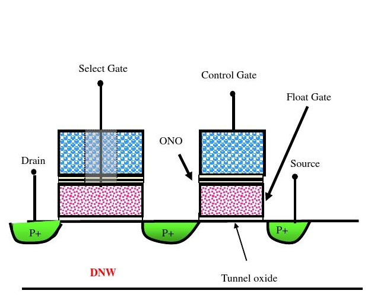

**图4：** *flash器件结构图*

- 真正的基于FLASH工艺的FPGA不应与内部带有FLASH存储器的FPGA类型混淆。  
- 具有内部FLASH存储器的基于SRAM的FPGA仅在启动期间使用FLASH存储器将数据加载到SRAM配置单元。  
- 真正基于FLASH工艺的FPGA使用FLASH作为配置存储的主要资源，并且不需要SRAM。  
- 功耗低。  
- 对辐射效应更宽容。  

#### 采用FLASH工艺的PLD

- **特性**:  
  - 具有多次可重复编程的能力。  
  - 非易失性：断电后，器件配置信息仍保存在PLD内。  

- **结构**:  
  - FLASH可采用多种结构，与EPROM单元类似，具有一个浮置栅晶体管单元和EEPROM器件的薄氧化层特性。  

---

#### Flash编程工艺总结

##### **FLASH存储机制**  

FLASH存储器基于**浮栅晶体管（Floating Gate Transistor）**实现数据存储，核心原理是通过电荷捕获改变晶体管阈值电压。

- **单元结构**：  
  - **单晶体管（1T）结构**：每个存储单元仅需1个晶体管（与SRAM的6T结构不同），通过浮栅存储电荷。  
  - **电荷存储**：写入时向浮栅注入电子（编程）或移除电子（擦除），改变晶体管的导通状态（0或1）。  

- **工作方式**：  
  - **编程（写0）**：施加高电压使电子隧穿进入浮栅，提高阈值电压，晶体管关闭。  
  - **擦除（写1）**：施加反向电压或紫外光，释放浮栅中的电子，降低阈值电压，晶体管导通。  
  - **读取**：通过检测阈值电压差异判断存储状态。  

---

##### **FLASH编程工艺技术特征**  

1. **非易失性存储**  
   - **断电后数据保留**：浮栅电荷可保持数年（典型值＞10年），无需持续供电。  
   - *修正说明*：原描述中“断电后数据丢失”错误，此为SRAM特性，FLASH为非易失性。  

2. **有限擦写次数**  
   - **耐久性**：通常支持 \(10^4\)-\(10^5\) 次擦写（原描述“无限次擦写＞\(10^{15}\)次”为SRAM特性）。  
   - *原因*：电荷隧穿导致氧化层逐渐退化，最终失效。  

3. **静态功耗极低**  
   - **待机功耗**：接近0 μW/bit（原描述“0.5μW/bit”更接近SRAM的漏电流功耗）。  
   - *动态功耗*：编程/擦除需高压（10-20V），瞬时功耗较高。  

4. **高单元密度**  
   - **结构优势**：1T单元结构比SRAM的6T更紧凑，相同工艺下密度可高40%-60%。  
   - *修正说明*：原描述“消耗大量硅片面积”错误，实为SRAM的缺点。  

5. **工艺兼容性**  
   - 与标准CMOS工艺兼容，可集成于逻辑芯片中（如eFlash技术）。  

---

#### **FLASH编程工艺优缺点分析**  

| **优点**                                | **缺点**                                  |
|---------------------------------------|-----------------------------------------|
| 1. **非易失性**：断电后数据长期保留。           | 1. **有限擦写次数**：\(10^4\)-\(10^5\)次后失效。 |
| 2. **高密度**：1T单元结构节省面积，适合大容量存储。 | 2. **高写入延迟**：擦除/编程需微秒至毫秒级。       |
| 3. **低静态功耗**：待机时几乎无能耗。           | 3. **高压操作**：需电荷泵电路，增加设计复杂度。      |
| 4. **成本较低**：单元面积小，适合大规模存储。      | 4. **数据保持衰减**：高温环境下电荷可能泄漏。        |

FLASH凭借**非易失性、高密度、低静态功耗**成为大容量长期存储的核心技术，但其**有限擦写次数、高写入延迟**限制了高频写入场景的应用。

---

### **可编程逻辑器件工艺对比分析**

#### **1. 熔丝 (Fuse)**  

- **技术原理**：通过熔断金属丝实现永久性编程（双极型工艺）。  
- **优点**：  
  - **高可靠性**：编程后不可逆，抗干扰能力强。  
  - **安全性**：数据无法篡改，适合安全敏感场景（如军事、金融）。  
  - **低静态功耗**：无漏电流问题。  
- **缺点**：  
  - **不可重复编程**：一旦熔断无法修改，设计灵活性极低。  
  - **低密度**：双极型工艺集成度低，占用面积大。  
  - **高编程电压**：需大电流熔断，增加外围电路复杂度。  
- **典型应用**：一次性配置的ASIC、加密芯片。  

---

#### **2. 反熔丝 (Antifuse)**  

- **技术原理**：通过高压击穿绝缘层形成导电通路（CMOS+工艺）。  
- **优点**：  
  - **非易失性**：断电后数据保留。  
  - **高密度**：比熔丝结构更紧凑（基于CMOS改进）。  
  - **抗辐射**：适合航天等恶劣环境。  
- **缺点**：  
  - **不可重复编程**：仅支持一次性写入。  
  - **高编程电压**：需10-20V高压，设计复杂。  
  - **成本高**：工艺复杂度高于标准CMOS。  
- **典型应用**：FPGA配置存储器、航天电子。  

---

#### **3. EPROM (UVCMOS)**  

- **技术原理**：紫外线擦除浮栅电荷（UVCMOS工艺）。  
- **优点**：  
  - **非易失性**：数据长期保留（＞10年）。  
  - **可重复编程**：支持多次修改（需紫外线擦除）。  
  - **成本较低**：工艺与标准CMOS兼容。  
- **缺点**：  
  - **擦除不便**：需移出电路并用紫外线照射，耗时数十分钟。  
  - **有限耐久性**：约 \(10^2\)-\(10^3\) 次擦写。  
  - **速度慢**：编程和擦除时间在毫秒级。  
- **典型应用**：早期固件存储、微控制器程序存储器。  

---

#### **4. EEPROM (EECMOS)**  

- **技术原理**：电信号擦除浮栅电荷（EECMOS工艺）。  
- **优点**：  
  - **非易失性**：断电数据不丢失。  
  - **电路内擦写**：无需移出设备，操作便捷。  
  - **较高耐久性**：支持 \(10^4\)-\(10^5\) 次擦写。  
- **缺点**：  
  - **单元面积大**：每个存储单元需额外选择晶体管，密度低于FLASH。  
  - **高写入延迟**：擦除/编程需毫秒级时间。  
  - **功耗较高**：擦写时需高压电荷泵。  
- **典型应用**：配置参数存储、小容量非易失性存储器。  

---

#### **5. SRAM (CMOS)**  

- **技术原理**：基于6晶体管双稳态触发器（CMOS工艺）。  
- **优点**：  
  - **高速读写**：纳秒级延迟，适合实时处理。  
  - **无限耐久性**：理论擦写次数＞\(10^{15}\) 次。  
  - **动态功耗低**：仅在读写时耗电。  
- **缺点**：  
  - **易失性**：断电后数据丢失，需后备电源。  
  - **低密度**：6T结构占用面积大，成本高昂。  
  - **静态功耗**：漏电流导致待机能耗较高。  
- **典型应用**：CPU高速缓存、寄存器文件。  

---

#### **6. FLASH 工艺**  

- **技术原理**：浮栅晶体管电荷存储（1T单元，CMOS兼容）。  
- **优点**：  
  - **非易失性**：数据保留＞10年。  
  - **高密度**：1T单元结构，密度比SRAM高40%-60%。  
  - **低静态功耗**：待机时接近零功耗。  
- **缺点**：  
  - **有限耐久性**：\(10^4\)-\(10^5\) 次擦写后失效。  
  - **高写入延迟**：擦除/编程需微秒至毫秒级。  
  - **高压操作**：需电荷泵电路，设计复杂度高。  
- **典型应用**：固态硬盘（SSD）、嵌入式存储、大容量固件。  

---

#### **编程工艺综合对比表**  

| **工艺**      | **可重复编程** | **易失性** | **耐久性**       | **密度** | **速度**     | **功耗**       | **典型应用**              |
|---------------|----------------|------------|------------------|----------|--------------|----------------|-------------------------|
| **熔丝**       | 否             | 否         | 1次              | 低       | 中（编程慢）  | 低静态          | ASIC、加密芯片           |
| **反熔丝**     | 否             | 否         | 1次              | 中       | 中（编程慢）  | 低静态          | FPGA配置、航天电子       |
| **EPROM**     | 是（需移出）    | 否         | \(10^2\)-\(10^3\) | 中       | 慢（擦除慢）  | 中             | 早期固件存储             |
| **EEPROM**    | 是（电路内）    | 否         | \(10^4\)-\(10^5\) | 中低     | 中慢         | 中高（动态）    | 配置参数存储             |
| **SRAM**      | 是（电路内）    | 是         | ＞\(10^{15}\)     | 低       | 极快（ns级）  | 高静态，低动态  | CPU缓存、实时处理        |
| **FLASH**     | 是（电路内）    | 否         | \(10^4\)-\(10^5\) | 高       | 慢（μs-ms级） | 低静态，高动态  | SSD、嵌入式存储          |

---

#### **技术选型建议**  

1. **高频读写场景**：选择 **SRAM**（如CPU缓存），牺牲非易失性换取速度。  
2. **大容量存储**：选择 **FLASH**（如SSD），平衡密度、成本和耐久性。  
3. **配置参数存储**：选择 **EEPROM**（小容量）或 **反熔丝**（高安全性）。  
4. **一次性编程需求**：选择 **熔丝/反熔丝**，确保数据不可篡改。  
5. **历史遗留系统**：**EPROM** 仍用于部分旧设备维护。  

---

### **编程工艺技术总结**

- **非易失性工艺**（FLASH、EEPROM、熔丝/反熔丝）适合长期数据存储，但需权衡擦写次数和速度。  
- **易失性工艺**（SRAM）以速度和无限耐久性为核心优势，依赖持续供电。  
- **一次性编程工艺**（熔丝/反熔丝）在安全性和可靠性上无可替代，但灵活性最低。  
- 技术演进趋势：FLASH向3D堆叠提升密度，SRAM通过新架构（如FinFET）优化功耗，反熔丝在航天领域持续迭代。

---

## CPLD原理及结构

### 复杂可编程逻辑器件（CPLD）概述

- **结构**:
  - CPLD 由多个类似 SPLD 的块集成在单个芯片上组成。
  - 与 SPLD 相比，CPLD 更加复杂，甚至在其基本类似 SPLD 的块级别也是如此。

- **讨论重点**:
  - **商用产品概述**:  
    - 首先对市场上的商用 CPLD 产品进行详细讨论。
  - **适用应用**:  
    - 探讨 CPLD 最适合的应用类型。
  - **产品比较**:  
    - 提供足够的细节，便于比较各种竞争产品。
    - 特别关注使用更广泛的器件。

---

### **Altera CPLDs**

- **产品系列**:
  - Altera 开发了三类属于 CPLD 的芯片系列：MAX 5000、MAX 7000 和 MAX 9000。
  - **MAX 7000 系列**:
    - 广泛使用，提供先进的逻辑容量和速度性能。
    - 是讨论的重点。
  - **MAX 5000 系列**:
    - 代表了一种较旧的技术，提供成本效益高的解决方案。
  - **MAX 9000 系列**:
    - 与 MAX 7000 类似，但提供更高的逻辑容量（业界最高）。

- **MAX 7000 系列架构**:
  - 如图8所示，由以下部分组成：
    - **Logic Array Blocks (LABs)**: 逻辑阵列块。
    - **Programmable Interconnect Array (PIA)**: 可编程互连阵列，能够连接任何 LAB 的输入或输出。
  - 芯片的输入和输出直接连接到 PIA 和 LABs。
  - LAB 可以被视为一种复杂的 SPLD 结构，因此整个芯片可以看作是一个 SPLD 阵列。
  - **编程技术**:
    - MAX 7000 器件基于 EPROM 和 EEPROM 技术。
    - 1996 年，Altera 发布了 7000S 系列，支持“电路内”可重复编程。

- **LAB 结构**:

  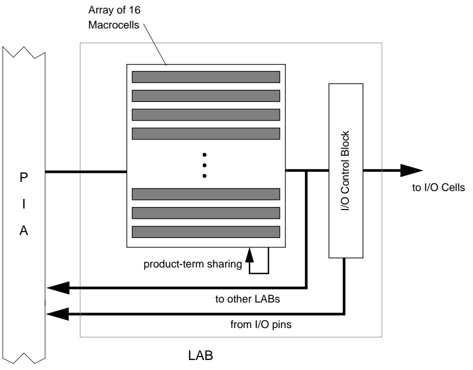
  
  **图5：** *Altera MAX7000的逻辑阵列模块（Logic Array Block，LAB).*

  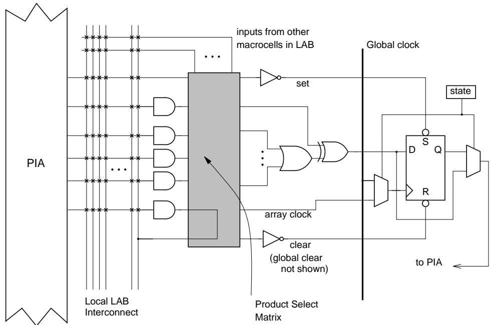
  
  **图6：** *MAX7000宏单元.*

  - 如图5所示，每个 LAB 由两组八个**宏单元**组成（如图10所示）。
  - **宏单元**:
    - 包含一组可编程乘积项（与门平面的一部分），驱动或门和触发器。
    - 触发器可配置为 D 型、JK、T、SR 或透明。
  - **或门输入**:
    - 或门的输入数量可变，可以来自宏单元内的最多五个乘积项，还可以从同一 LAB 内的其他宏单元引入最多15个额外的乘积项。
    - 这种灵活性使得 MAX 7000 系列在芯片面积利用上更加高效。

### **AMD Mach 系列 CPLD**

- **产品系列**:
  - AMD 提供五个子系列的 CPLD，称为 Mach 1 到 Mach 5。
  - 每个 Mach 器件由多个类似 PAL 的块组成：
    - **Mach 1 和 Mach 2**: 由优化的 22V16 PAL 构成。
    - **Mach 3 和 Mach 4**: 由多个优化的 34V16 PAL 构成。
    - **Mach 5**: 结构类似，但提供增强的速度性能。
  - **编程技术**: 所有 Mach 芯片都基于 EEPROM 技术。
  - **产品范围**: 五个子系列提供了广泛的选择，从小型、低成本的芯片到大型、先进的芯片。
  - **讨论重点**: Mach 4 系列，因为它代表了 Mach 家族中最先进的产品。

- **Mach 4 架构**:
  - 如图7所示，Mach 4 芯片由多个 34V16 类似 PAL 的块组成，并通过中央交换矩阵（Central Switch Matrix）互连。
  - **芯片规模**: 从 6 到 16 个 PAL 块不等，对应的等效门数约为 2000 到 5000。
  - **编程方式**: 支持电路内编程。
  - **互连方式**: 所有 PAL 块之间的连接（包括块内部连接）都通过中央交换矩阵进行。
  - **延迟特性**: 由于所有连接都通过相同的路径，Mach 4 实现的电路时序延迟是可预测的。

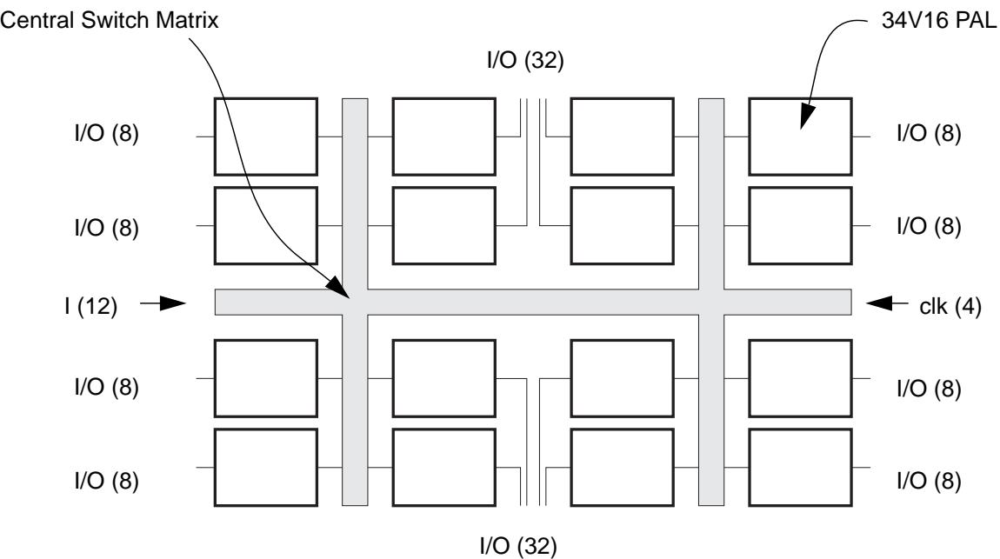
**图7** *AMD Mach 4 CPLD结构.*

- **Mach 4 PAL 块结构**:
  - 每个类似 PAL 的块具有 16 个输出和 34 个输入（其中 16 个为反馈输出），相当于一个 34V16 PAL。
  - **关键改进**:
    1. **乘积项分配器（Product Term Allocator）**: 位于与门平面和宏单元之间，负责将与门平面的乘积项分配给需要的或门。
    2. **输出交换矩阵（Output Switch Matrix）**: 位于或门和 I/O 引脚之间，允许任何宏单元输出驱动连接到 PAL 块的任何 I/O 引脚。
  - **灵活性**:
    - 乘积项分配器使得与门平面的乘积项可以在或门之间灵活共享。
    - 输出交换矩阵增强了引脚分配的灵活性。
  - **优点**: 系统内编程和高灵活性使得硬件设计变更更加容易。

### **Lattice CPLDs**

- **产品系列**:
  - Lattice 提供完整的 CPLD 产品线，主要包括两类产品：  
    - **pLSI**: 三个系列的 EEPROM 型 CPLD。
    - **ispLSI**: 与 pLSI 相同，但支持系统内编程（in-system programmable）。
  - **产品家族**:
    - 每个系列（pLSI 和 ispLSI）都提供三种不同逻辑容量和速度性能的产品。

- **1000 系列**:
  - **逻辑容量**: 约 1200 到 4000 门。
  - **引脚到引脚延迟**: 10 纳秒。
  - **结构**:
    - 由多个类似 SPLD 的块组成，通过全局路由池（Global Routing Pool, GRP）连接。

- **2000 系列**:
  - **逻辑容量**: 600 到 2000 门。
  - **特点**:
    - 宏单元与 I/O 引脚的比率更高。
    - 速度性能优于 1000 系列。
  - **引脚到引脚延迟**: 5.5 纳秒，提供业界领先的速度。

- **3000 系列**:
  - **逻辑容量**: 高达 5000 门。
  - **引脚到引脚延迟**: 约 10-15 纳秒。
  - **功能**:
    - 与 AMD Mach 4 相似。
    - 提供额外的增强功能，支持 JTAG 边界扫描等现代设计风格。

- **Lattice pLSI/ispLSI 结构**:
  - 如图8所示，芯片外边缘是双向 I/O，直接连接到**通用逻辑块（Generic Logic Blocks, GLBs）**和**全局路由池（GRP）**。
  - **GLBs**:
    - 类似 PAL 的小块，包含与门平面、乘积项分配器和宏单元。
  - **GRP**:
    - 一组跨越整个芯片的导线，用于连接 GLB 的输入和输出。
    - 所有互连都通过 GRP 进行，因此Lattice芯片的时序完全可预测，类似于 AMD Mach 器件。

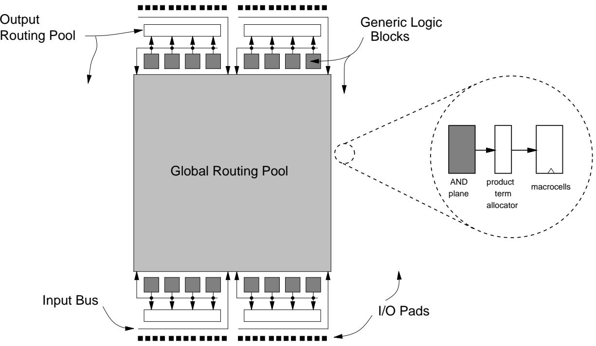
**图8：** *Lattice (i)PLSI架构图.*

---

### **Cypress CPLDs**

- **技术基础**:
  - Cypress 最近开发了一类 CPLD 产品，称为 FLASH370，基于 FLASH EEPROM 技术。
  - 在多个方面与 AMD 和 Lattice 的器件类似。

- **性能**:
  - **引脚到引脚延迟**: 8.5 到 15 纳秒。
  - **编程方式**: 不支持系统内编程。

- **I/O 特点**:
  - 较大的芯片需要更多的 I/O，因此 FLASH370 提供了比竞争产品更多的 I/O。
  - 宏单元数量与双向 I/O 引脚数量呈线性关系：
    - 最小器件：32 宏单元和 32 I/O。
    - 最大器件：256 宏单元和 256 I/O。

- **架构**:
  - 如图9所示，FLASH370 具有典型的 CPLD 架构：
    - 多个类似 PAL 的块。
    - 可编程互连矩阵（Programmable Interconnect Matrix, PIM）用于连接这些块。
  - **PAL 块内部结构**:
    - **与门平面（AND-plane）**: 驱动乘积项分配器。
    - **乘积项分配器**: 将 0 到 16 个乘积项分配给每个或门（共32个）。
    - **反馈路径**: 从宏单元输出到 PIM 有 32 条导线，允许宏单元被“埋入”（不驱动 I/O 引脚），同时仍可将 I/O 引脚用作输入。

- **灵活性**:
  - CPLD 中类似 PAL 的块提供了额外灵活性，这是普通 PAL 所不具备的。

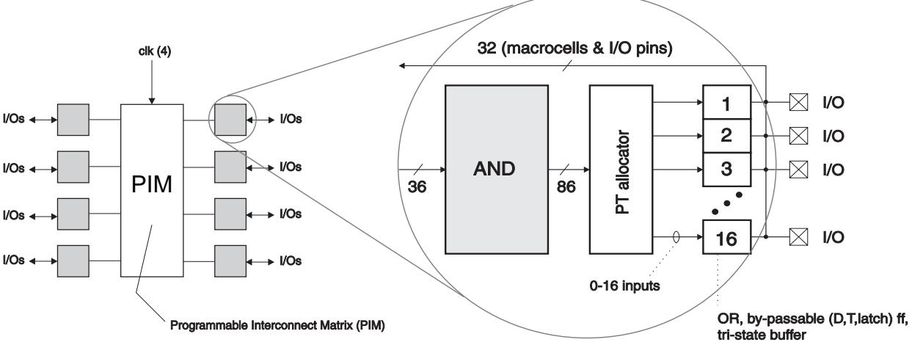
**图9** *Cypress FLASH370 CPLD架构图.*

---

### **Xilinx XC7000 CPLDs**

- **概述**:
  - Xilinx 主要生产 FPGA，但也提供一系列 CPLD，称为 XC7000，并宣布了新的 CPLD 系列 XC9500。
  - XC7000 系列包括两个主要家族：7200 系列和 7300 系列。

- **7200 系列**:
  - **来源**: 最初由 Plus Logic 作为 Hiper EPLDs 推向市场。
  - **逻辑容量**: 约 600 到 1500 门。
  - **速度性能**: 引脚到引脚延迟约为 25 纳秒。
  - **结构**:
    - 由多个类似 SPLD 的块组成，每个块包含 9 个宏单元。
  - **宏单元特点**:
    - 每个宏单元包含两个或门。
    - 每个或门的输入连接到一个两位算术逻辑单元（ALU）。
    - ALU 可以生成其两个输入的任何函数，并将其输出馈送到可配置的触发器中。

- **7300 系列**:
  - **特点**: 是 7200 系列的增强版本。
  - **逻辑容量**: 高达 3000 门（当整个系列可用时）。
  - **速度性能**: 更高的速度性能。

- **XC9500 系列**:
  - **特点**: 
    - 支持系统内编程。
    - 引脚到引脚延迟为 5 纳秒。
    - 逻辑容量高达 6200 门。

---

### **CPLD 的应用**

CPLD 因其高速度和广泛的容量范围，适用于多种应用，从实现随机粘合逻辑到小型门阵列的原型设计。
目前工业中最常见的用途之一是将多个 SPLD 的设计转换为更少数量的 CPLD，这是 CPLD 市场快速增长的重要原因。

---

#### **具体应用**

- **复杂设计实现**:  
  - 如图形控制器、LAN 控制器、UARTs、缓存控制等。
- **适合的电路类型**:  
  - 能够利用宽与门/或门且不需要大量触发器的电路非常适合在 CPLD 中实现。

---

#### **设计优势**

- **可重复编程**:  
  - 所有商用 CPLD 产品都支持重新编程，简化了设计变更。
- **系统内编程**:  
  - 支持在不停机的情况下重新配置硬件（例如更改通信电路的协议）。
- **设计分区**:
  - 设计通常自然地划分为 CPLD 中类似 SPLD 的块。
- **性能预测**:  
  - 设计分区的结果是比将设计分割成许多小部分并将其映射到芯片不同区域更可预测的速度性能。
  - 这是 CPLD 架构最显著的优势之一。

---

## **FPGA**

- **市场背景**:
  - FPGA 市场是半导体行业中增长最快的领域之一，但其市场格局变化迅速，公司在其中的参与度也在快速变化。
  - 由于很难预测行业稳定时哪些产品将成为主流，因此本节将聚焦于当前广泛使用的产品，而非列举所有 FPGA 制造商。

- **容量描述**:
  - 在描述每个器件时，将列出其容量，通常以供应商提供的等效 2 输入与非门（NAND 门）数量表示。
  - 注意：FPGA 行业中的门数计算存在争议，因此本文提供的数字仅供参考。

- **FPGA 分类**:
  1. **基于 SRAM 的 FPGA**:
     - 主要厂商：Xilinx 和 Altera，AT&T 是主要竞争对手。
  2. **基于反熔丝的 FPGA**:
     - 主要厂商：Actel、Quicklogic、Cypress 和 Xilinx。

---

### **Xilinx 基于 SRAM 的 FPGA**

#### **基本结构**:

- Xilinx FPGA 的基本结构是**基于阵列的**，即每个芯片由一个二维逻辑块阵列组成，逻辑块通过水平和垂直的布线通道互连。
- 图2展示了这种架构的示意图。

- **产品系列**:
- **XC2000 系列**: 首个 FPGA 系列，于1985年推出。
- **XC3000 系列**: 仍广泛使用。
- **XC4000 系列**: 更现代且更受欢迎的系列。
- **XC5000 系列**: 与 XC4000 类似，但以更具吸引力的价格提供相似功能，速度略有损失。
- **XC8100 系列**: 基于反熔丝技术的新系列，暂未广泛使用。
- **容量范围**: XC4000 系列的容量从约 2000 到超过 15000 等效门。

---

#### **XC4000 逻辑块（CLB）**:

- **查找表（LUTs）**:
  - LUT 是一个小型的单比特宽存储阵列，存储器地址线是逻辑块的输入，输出是 LUT 的输出。
  - 一个具有 K 个输入的 LUT 对应一个 2^K x 1 比特的存储器，通过将逻辑函数的真值表编程到存储器中，可以实现任意 K 输入逻辑函数。
- **CLB 结构**:
  - 如图18所示，每个 CLB 包含三个独立的 LUT：
    - 两个 4 输入 LUT，由 CLB 输入驱动。
    - 第三个 LUT 可以与前两个结合使用。
  - 这种配置允许 CLB 实现多达 9 输入的广泛逻辑函数，或实现两个独立的 4 输入函数。
  - 每个 CLB 还包含两个触发器。

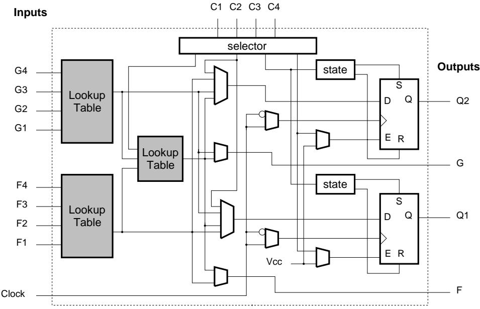
**图10 -** *Xilinx XC4000 可配置逻辑块（CLB）。*

---

#### **系统级特性**:

- **算术电路**: 每个 CLB 包含高效执行算术运算的电路（如快速进位操作）。
- **RAM 配置**: CLB 中的 LUT 可以配置为读/写 RAM 单元。
- **XC4000E 版本**:
  - RAM 可以配置为双端口 RAM，具有一个写端口和两个读端口。
  - RAM 块可以配置为同步 RAM。
- **宽与门平面**: 芯片外围包含非常宽的与门平面，便于实现宽解码器等电路块。

---

#### **互连结构**:

- 互连结构是 FPGA 的另一个关键特征。
- **布线通道**:  
  - 分为水平和垂直通道。
  - 通道中包含：
    - 短线段：跨越单个 CLB。
    - 长线段：跨越两个 CLB。
    - 超长线段：跨越整个芯片的长度或宽度。
  - 可编程开关用于连接 CLB 的输入输出和线段，或连接不同的线段。
- **重要特点**:  
  - 信号必须通过开关从一个 CLB 传递到另一个 CLB，所经过的开关数量取决于所使用的线段。
  - 因此，实现电路的速度性能部分取决于 CAD 工具如何分配线段给各个信号。

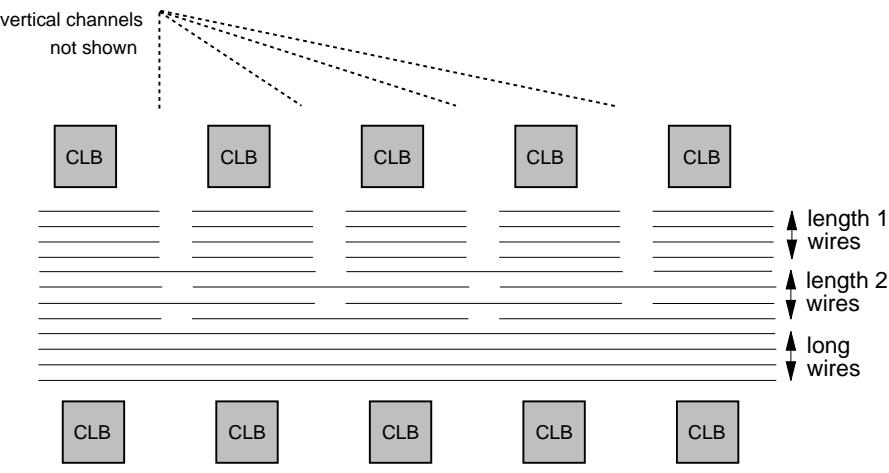
**图11 -** *Xilinx XC4000 线段示意图。*

---

### **Xilinx Artix-7 XC7A35T FPGA 的布局**

#### **FPGA 组成**

- Xilinx Artix-7 XC7A35T FPGA 主要由以下九个组件构成：
  1. 输入/输出块（I/O Blocks）
  2. 可配置逻辑块（CLBs）
  3. 互连资源
  4. 块 RAM
  5. DSP 切片
  6. 时钟管理块
  7. XADC 块
  8. 高速串行 I/O 收发器
  9. PCIe 接口
- 这些模块的布局如图2.9所示。
- 大多数模块也可以通过 Vivado 设计套件观察到（将在第4章介绍）。
- 读者将有机会在设计数字系统时观察使用了哪些模块。
- 这些模块（或其变体）在 FPGA 中几乎是标准的，但不同 FPGA 家族可能会缺少某些模块或包含额外的模块。

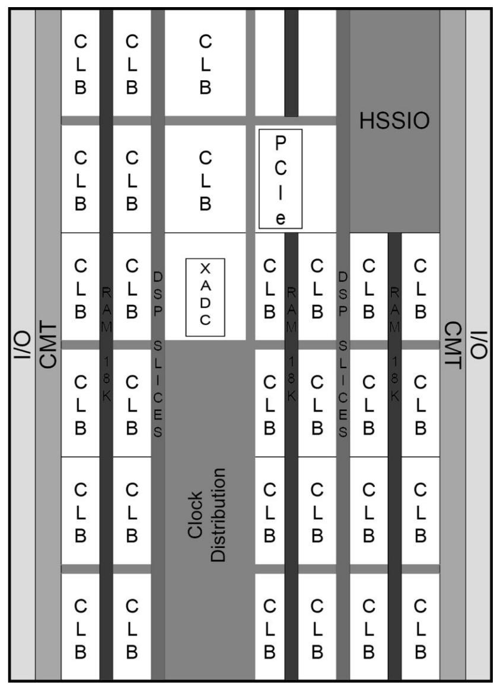  
**图12 - Artix-7 XC7A35T FPGA 的基本组成模块。**

---

#### **输入/输出块**

##### **简介**

- 数字设备通过其输入和输出引脚与外界交互，FPGA 也不例外。
- 数据通过输入引脚从外部获取，输出引脚用于将数据输出到外部。
- 这些输入和输出引脚位于 FPGA 的输入/输出块中。

##### **电压与引脚数量**

- Artix-7 XC7A35T FPGA 的输入/输出引脚支持标准电压范围：1.2 到 3.3 V。
- Basys3 开发板上的 FPGA 有 106 个输入/输出引脚。
- Arty 开发板上的 FPGA 有 210 个输入/输出引脚。
- 这些引脚可以用作输入、输出或两者兼用。

##### **引脚模式**

1. **输入模式**: 通过引脚从外部获取数据。
2. **输出模式**: 通过引脚向外部输出电压电平。
3. **双向模式**: 同一引脚可用于输入和输出。

##### **引脚分组与模式**

- 输入/输出引脚被分组为**组（Banks）**。
- 每组中的两个引脚被分组为正（P）负（N）对。
- **单端模式**:
  - 输入电压接近地电平时，逻辑电平为 0。
  - 输入电压接近 *VCC* 时，逻辑电平为 1。
- **差分模式**:
  - 引脚 P 的电压低于引脚 N 时，逻辑电平为 0。
  - 引脚 P 的电压高于引脚 N 时，逻辑电平为 1。
- **参考模式**:
  - 输入电压低于参考电压时，逻辑电平为 0。
  - 输入电压高于参考电压时，逻辑电平为 1。

##### **输出模式**

- 单端引脚也可用作输出。
  - 逻辑电平为 1 时，引脚电压为 *VCC*。
  - 逻辑电平为 0 时，引脚电压为地电平。

---

### **可配置逻辑块（CLB）**

- **简介**:
  - 可配置逻辑块（CLB）是 FPGA 中实现数字系统的基本元素。
  - CLB 的核心包括查找表（LUT）、触发器和多路复用器。

#### **多路复用器**

- **基本概念**:
  - 多路复用器是一种选择器，具有 *N* 个选择位、2 *N* 个输入引脚和1个输出引脚。
  - 通过选择位决定哪个输入引脚连接到输出。
- **二选一多路复用器**:
  - 图2.10展示了由基本逻辑门构成的二选一多路复用器的电路图。
  - 工作原理：
    $$out = \begin{cases} \text{in1} & \text{if sel = 0} \\ \text{in2} & \text{if sel = 1} \end{cases} \tag{2.4}$$
  - 选择引脚（sel）决定哪个输入连接到输出。
- **32选1多路复用器**:
  - 有5个选择位，可以选择32个输入中的其中一个。

  
**图13 - 由基本逻辑门构成的二选一多路复用器电路图。**

#### **触发器**
- **基本概念**:
  - 触发器是 FPGA 中的基本存储单元，能够存储1位数据。
  - 触发器可以通过数字逻辑门构建，但其布局较为复杂。
  - 触发器以抽象形式表示为图2.11，其中 `in` 引脚用于设置存储的位值，`out` 引脚用于获取存储的值。
  - 触发器只能存储逻辑电平0或1。

  
**图14 - 触发器的抽象表示。**

#### **查找表（LUT）**
- **基本概念**:
  - LUT 是一组触发器，连接到多路复用器的输入引脚。
  - 多路复用器的选择位用于选择要访问的触发器地址。
  - LUT 可以实现任何以选择位为输入变量的组合逻辑函数。
  - 当触发器的内容改变时，实现的逻辑函数也会改变，从而实现 FPGA 的可重构性。
- **N 输入 LUT**:
  - 具有 2 *N* 个表项，*N* 个选择位。
  - 图2.12展示了一个由触发器和多路复用器构成的抽象 LUT。
  - Artix-7 FPGA 中，两个5输入的 LUT 可以组合实现6输入、7输入或8输入的组合逻辑函数。

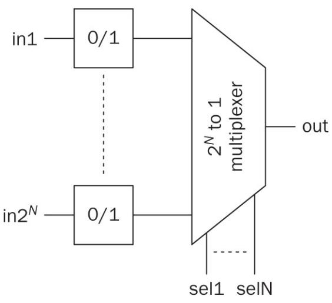  
**图14 - N 输入 LUT 的抽象表示。**

---

### **互连资源**

- **简介**:
  - 互连资源由电线和可编程开关组成，负责连接 FPGA 中的 CLB 和其他构建模块。
  - 互连也称为布线通道。
  - Artix-7 FPGA 中的 CLB 以网格结构布置，简化了互连使用的规划。
  - 初级或中级用户无需了解互连功能，Vivado 设计套件负责高效使用这些资源。

---

### **块 RAM**

- **简介**:
  - 与由 SLICEM 块组成的分布式存储元件不同，Artix-7 FPGA 还具有块 RAM 模块。
  - 块 RAM 可用于存储数据，还可以构成缓冲区、大型 LUT 或移位寄存器。
- **容量**:
  - 每个块 RAM 可以存储 36-kbit 的数据块或两个 18-kbit 的数据块。
  - FPGA 中共有 50 个块 RAM，总容量为 1800 kbits。
  - 每个 36-kbit 块 RAM 的数据宽度为 64 位，额外 8 位用于数据读取过程中的单比特错误纠正或双比特错误检测。

---

### **DSP 切片**

- **简介**:
  - 现代 FPGA 中有专门用于算术和逻辑运算的模块，称为数字信号处理（DSP）切片。
  - Artix-7 FPGA 中的 DSP 切片称为 DSP48E1，共有 90 个。
- **功能**:
  - 每个 DSP 切片可以执行多种算术和逻辑运算，包括：
    - 25 位和 18 位二进制数的乘法。
    - 48 位数的加法、减法和累加。
    - 48 位数的逻辑运算。
  - 这些运算在没有 DSP 切片的情况下需要复杂的算法实现，因此 DSP 切片在实现中非常高效。

---

### **时钟管理**

- **简介**:
  - 时钟是一个周期性方波信号，用于同步数字系统的运行。
  - 大多数数字系统需要时钟信号来同步逻辑操作。
- **时钟管理**:
  - Artix-7 FPGA 没有内部时钟生成电路，用户需要向 FPGA 提供时钟信号。
  - 一些输入/输出引脚能够接收时钟信号。
  - 时钟信号进入 FPGA 后，可以由时钟管理模块（CMT）处理并分配到整个 FPGA。
  - Basys3 和 Arty 开发板提供外部时钟源。
  - Artix-7 FPGA 分为六个时钟区域，每个区域包含大部分或所有 FPGA 构建模块。

---

### **Altera FLEX 8000**

- **概述**:
  - Altera 的 FLEX 8000 系列具有类似于 CPLD 的三层层次结构，但其最低层由查找表（LUT）组成，而不是类似 SPLD 的块，因此被归类为 FPGA。
  - FLEX 8000 结合了 FPGA 和 CPLD 技术，基于 SRAM，使用 4 输入 LUT 作为其基本逻辑块。
  - **逻辑容量**: 从约 4000 门到超过 15000 门。

**图12:** *Altera FLEX 8000 FPGA 架构。*

---

### **XADC 模块**

- 模拟信号可以通过采样和量化后被数字系统处理，执行这些操作的模块称为模数转换器（ADC）。由于数字系统的最新进展需要处理模拟信号，Artix-7 FPGA 专门配备了 XADC 模块。
- Artix-7 XC7A35T FPGA 包含一个 XADC 模块，该模块由两个 ADC 模块组成。每个模块每秒可以采集 100 万个样本（MSPS），每个样本用 12 位表示。两个 ADC 模块可以同时处理两个不同的模拟信号。

### **高速串行 I/O 收发器**

- 高速串行 I/O 收发器（HSSIOs）是专门用于传输和接收串行数据的电路。这些收发器是进行速度约为每秒千兆比特（Gb/s）数据传输的必备组件。

- PCIe（外围组件互连高速）是一种高速串行连接总线标准。Artix-7 XC7A35T FPGA 包含一个用于 PCIe 接口的集成模块。

---

- **FLEX 8000 架构**:
  - 如图13所示，FLEX 8000 的基本逻辑块称为**逻辑元素（Logic Element, LE）**，包含一个 4 输入 LUT、一个触发器以及用于算术电路的特殊进位电路（类似于 Xilinx XC4000）。
  - LE 还包括级联电路，可高效实现宽与函数。
  - **LE 细节**: 如图21所示。

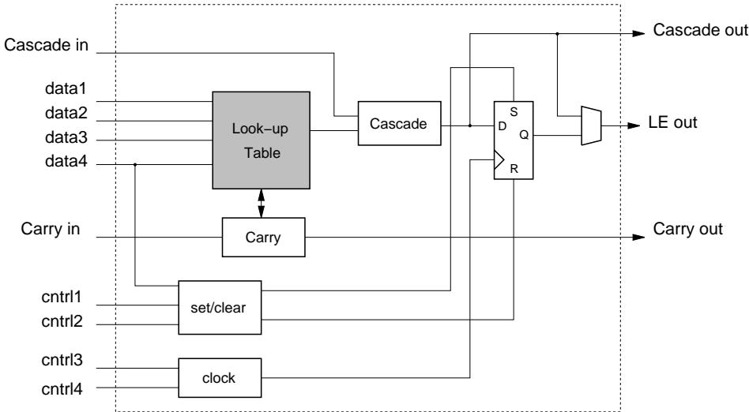
**图13:** *Altera FLEX 8000 逻辑单元（LE）。*

---

- **逻辑阵列块（LAB）**:
  - LE 被分组为 8 个一组的**逻辑阵列块（Logic Array Blocks, LABs）**，这个概念借用了 Altera 的 CPLD。
  - 如图14所示，每个 LAB 包含本地互连，每条本地线可以连接同一 LAB 内的任何 LE。
  - 本地互连还连接到 FLEX 8000 的**全局互连（FastTrack）**。
  - **FastTrack**: 类似于 Xilinx 的长线，每条 FastTrack 线延伸整个芯片的宽度或高度。
  - **特点**: FLEX 8000 只有长线，这使得 CAD 工具能够自动配置，且互连延迟比使用许多小段线的 FPGA 更可预测。

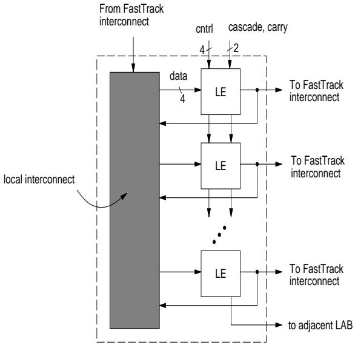
**图14:** *Altera FLEX 8000 逻辑阵列块（LAB）。*

---

- **FLEX 10000 系列**:
  - FLEX 10000 是对 FLEX 8000 架构的扩展，增加了可变大小的 SRAM 块，称为**嵌入式阵列块（Embedded Array Blocks, EABs）**。
  - **EAB 功能**:  
    - 可以配置为具有可变宽高比的 SRAM 块：256 x 8、512 x 4、1K x 2 或 2K x 1。
    - 也可以配置为实现复杂逻辑电路（如乘法器），作为大型多输出查找表使用。
  - **CAD 工具支持**: Altera 提供了多个宏函数，用于在 EAB 中实现有用的逻辑电路。
  - **逻辑容量**: 目前 FPGA 中最高，但难以提供准确数字。

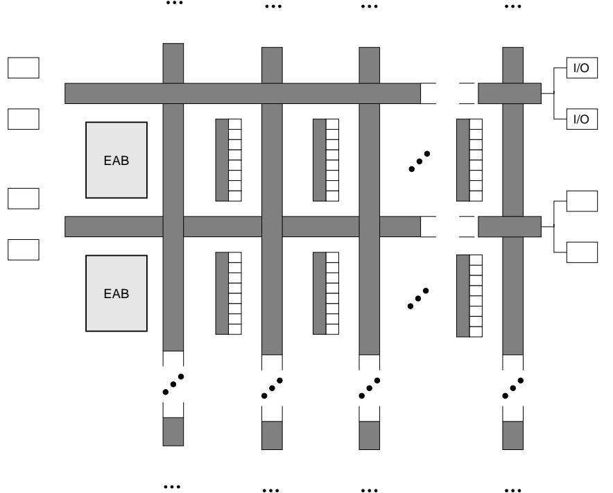
**图15：** *Altera FLEX 10K FPGA 架构。*

---

### **FPGA 的应用**

FPGA凭借硬件可编程、高并行性与灵活集成能力，广泛应用于通信、工业控制、嵌入式系统及高性能计算领域，成为实现快速原型开发与定制化加速的核心平台。

---

### **FPGA的具体应用**  

**1. 随机逻辑与系统集成**  

- **功能描述**：实现任意组合逻辑与时序逻辑（如状态机、计数器）。  
- **应用实例**：  
  - 替代传统SPLD（简单可编程逻辑器件），集成多个分立逻辑芯片的功能。  
  - 在中小型系统中整合SRAM、DSP等模块，构建片上系统（SoC）。  

**2. 设备控制与工业自动化**  

- **功能描述**：作为实时控制器，处理传感器输入并驱动执行机构。  
- **应用实例**：  
  - 工业机器人运动控制（多轴同步、PID算法）。  
  - 智能电网中的电力电子设备管理（如逆变器控制）。  

**3. 通信与信号处理**  

- **功能描述**：实现高速编码、解码、滤波及协议处理。  
- **应用实例**：  
  - 5G基带处理（LDPC编码、波束成形）。  
  - 光纤通信中的前向纠错（FEC）与数据包路由。  

**4. 设计原型与硬件仿真**  

- **功能描述**：验证ASIC或复杂系统的功能与性能。  
- **实现方式**：  
  - **设计原型**：单颗大容量FPGA（如Xilinx Virtex UltraScale+）模拟ASIC逻辑，缩短开发周期。  
  - **硬件仿真**：多FPGA互联系统（如Cadence Palladium）仿真超大规模电路（如AI芯片），支持早期软件调试。  

**5. 定制计算加速**  

- **功能描述**：将软件算法映射为硬件电路，突破通用处理器的性能瓶颈。  
- **应用实例**：  
  - 深度学习推理（TensorRT优化模型部署至FPGA）。  
  - 高频交易（纳秒级延迟的订单生成与处理）。  
  - 数据中心异构加速（微软Catapult项目使用FPGA提升Bing搜索效率）。  

---

### **FPGA的设计优势**  

**1. 并行计算能力**  

- **优势**：通过硬件级并行化（如流水线、多数据通路）实现吞吐量飞跃。  
- **案例**：  
  - 图像处理：单时钟周期内完成像素矩阵卷积（如边缘检测）。  
  - 密码学：同时处理多个AES加密块，速度提升数十倍。  

**2. 灵活可重构性**  

- **优势**：支持动态重配置（部分FPGA支持运行时重构），适应算法迭代与协议升级。  
- **案例**：  
  - 通信基站：通过远程更新支持5G NR新频段。  
  - 自动驾驶：根据传感器融合需求切换预处理算法。  

**3. 快速原型开发**  

- **优势**：无需流片即可验证设计，周期从数月缩短至数周。  
- **流程**：  
  1. RTL代码编写（Verilog/VHDL）。  
  2. 综合与布局布线（使用Vivado/Quartus工具链）。  
  3. 烧写至FPGA进行功能与时序验证。  

**4. 性能与功耗平衡**  

- **优势**：相比CPU/GPU，FPGA通过硬件优化实现更高能效比。  
- **数据对比**：  
  
  | **任务**         | **CPU (Intel Xeon)** | **GPU (NVIDIA V100)** | **FPGA (Xilinx Alveo)** |  
  |------------------|----------------------|-----------------------|-------------------------|  
  | 图像分类延迟      | 50 ms                | 10 ms                 | **2 ms**                |  
  | 能效（TOPS/W）   | 1.2                  | 5.8                   | **15.3**                |  

**5. 复杂互连与资源集成**  

- **优势**：支持高速串行接口（如PCIe、400G以太网）与异构资源（ARM核、AI引擎）。  
- **架构演进**：  
  - 传统FPGA：纯可编程逻辑阵列。  
  - 现代FPGA（如Xilinx Versal）：集成AI引擎、DSP切片、多核CPU，形成自适应计算平台。  

---

### **FPGA设计中的挑战与应对**  

#### **1. 时序收敛难题**  
- **问题**：互连延迟导致关键路径时序违例。  
- **解决方案**：  
  - 使用约束文件（SDC）优化布局。  
  - 采用高等级时序工具（如Synopsys PrimeTime）。  

#### **2. 开发门槛较高**  
- **问题**：需掌握硬件描述语言（HDL）与底层架构知识。  
- **趋势**：  
  - 高层次综合（HLS）：用C++/Python生成RTL代码。  
  - 预置IP核（如FFT、DDR控制器）降低开发难度。  

#### **3. 成本与功耗限制**  
- **问题**：大容量FPGA价格高昂，静态功耗显著。  
- **应对策略**：  
  - 选择工艺节点（如28nm vs. 7nm）平衡性能与成本。  
  - 动态功耗管理（时钟门控、电压调节）。  

---

### **未来趋势**  
1. **异构集成**：FPGA与CPU/GPU/存算一体芯片协同，构建高效计算集群。  
2. **AI驱动设计**：机器学习优化布局布线算法，提升性能预测精度。  
3. **垂直领域定制**：针对汽车、医疗等场景推出功能安全（FuSa）认证器件。  

---

### **总结**  
FPGA凭借其**硬件可编程性、并行处理能力**与**快速迭代优势**，已成为数字系统设计的核心组件。从通信基带到AI推理，从工业控制到定制计算，其应用边界持续扩展。随着工具链的智能化和架构的创新，FPGA将在高性能计算与边缘端加速中扮演更关键角色。

---

### **基于 FPGA 的数字系统设计哲学**

- 数字系统可以通过不同的设计策略和资源实现。本节讨论使用 FPGA 进行数字系统设计的哲学，强调如何有效地使用 FPGA。

### **使用 FPGA 时的思考方式**

- **设计自由**: 使用 FPGA 设计数字系统时，用户可以自由选择设计方法，同一个数字系统可以通过多种方式实现，设计师有责任选择最适合的设计风格。
- **无预定义模块**: FPGA 设计开始时没有预定义的模块，设计师需要使用强大的资源来构建所需的模块，因此需要扎实的数字逻辑知识。FPGA 厂商也提供 IP 模块以简化设计。
- **硬件描述语言（HDL）**: FPGA 设计使用硬件描述语言（HDL），而不是传统的顺序编程语言。设计应基于块级并行实现，以获得最佳性能。
- **可重构性**: FPGA 可以在初始设计完成后重新配置，用户可以利用这一特性在设计和嵌入设备后改进和修改设计。

### **FPGA 的优缺点**

- **离散元件**: 离散元件设计需要物理空间和复杂的布线，一旦实现后设计就无法更改。FPGA 提供了更紧凑的解决方案，且设计可以重新配置。
- **ASIC**: ASIC 克服了空间和布线问题，且在大规模生产时成本较低。然而，ASIC 设计一旦完成就无法更改，且制造时间较长。FPGA 在原型设计和验证方面具有优势。
- **微控制器**: 微控制器和 FPGA 都具有可重构性和紧凑性，但微控制器的指令集限制了其灵活性，且功率消耗较高。FPGA 具有并行实现能力，操作速度更快，且可以在 FPGA 上实现微控制器。

### **FPGA 的用途**

FPGA 可以用于几乎所有需要数字系统的领域。为了激励读者并说明学习基于 FPGA 的数字设计的重要性，以下列出 FPGA 的潜在应用领域：航空航天、汽车、广播、消费电子、国防、高性能计算、工业应用、医疗应用以及有线和无线通信。这些并非 FPGA 的唯一应用领域，新的应用可能会随着时间的推移而出现。

---

## FPGA与CPLD的主要区别有

1. **架构差异**  
   - FPGA 采用细粒度结构（LUT + 分布式寄存器），适合复杂时序逻辑。  
   - CPLD 采用粗粒度结构（乘积项 + 集中式宏单元），适合组合逻辑。

2. **资源规模**  
   - FPGA 逻辑单元数量多，集成RAM、DSP等模块。  
   - CPLD 逻辑资源较少，无专用硬件模块。

3. **时序特性**  
   - FPGA 时序优化依赖工具，延迟不可预测。  
   - CPLD 时序固定，适合确定性控制。

4. **适用场景**  
   - FPGA：视频处理、通信协议、AI加速等。  
   - CPLD：电源管理、接口转换、简单状态机。

---

### 选型建议

- **选择 FPGA**：需要高性能、高灵活性、支持复杂算法或大规模并行处理。  
- **选择 CPLD**：要求低功耗、快速启动、确定性延迟和小型逻辑控制。

### **习题**

- **1** 除了 OR 和 AND 逻辑门外，还有 NOR（NOT-OR）和 NAND（NOT-AND）门。请使用基本逻辑门结构来构建它们。
- **2** 在某些应用中还会使用 XOR 门，请使用 OR 和 AND 逻辑门构建该门。
- **3** FPGA 并非实现数字系统的唯一设备，请研究过去开发的类似设备。
- **4** Artix-7 FPGA 是我们在本书中考虑的系列，但 Xilinx 还有其他 FPGA 系列，请选择两个系列并将其属性与 Artix-7 FPGA 进行比较。
- **5** Xilinx 并非市场上唯一的 FPGA 生产商，请研究其他生产商。
  - a. 对 FPGA 开发商的市场份额进行评论。
  - b. 如果可能，比较不同生产商开发的 FPGA 的通用属性。
- **6** 微控制器和 FPGA 的主要区别是什么？
