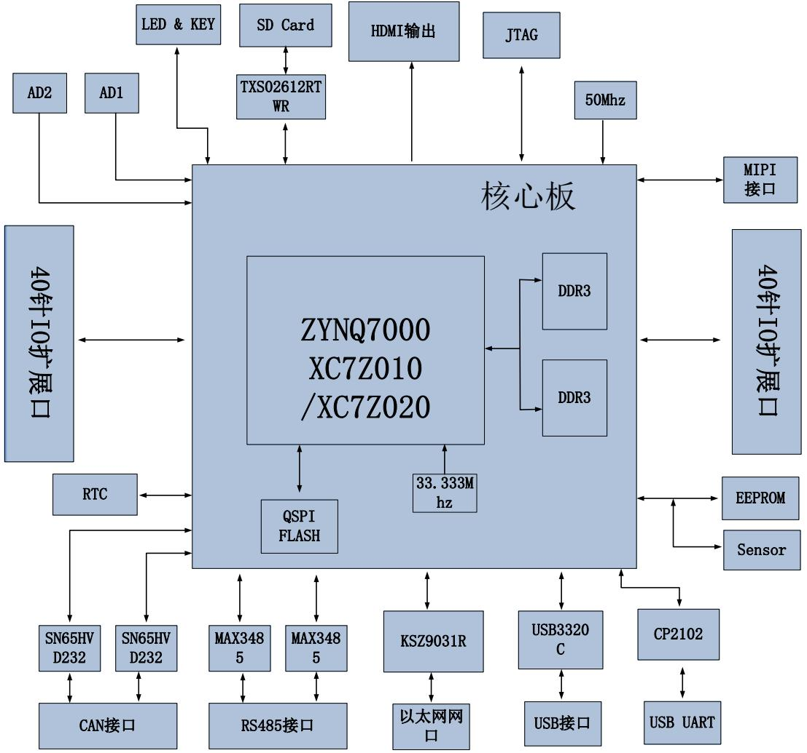
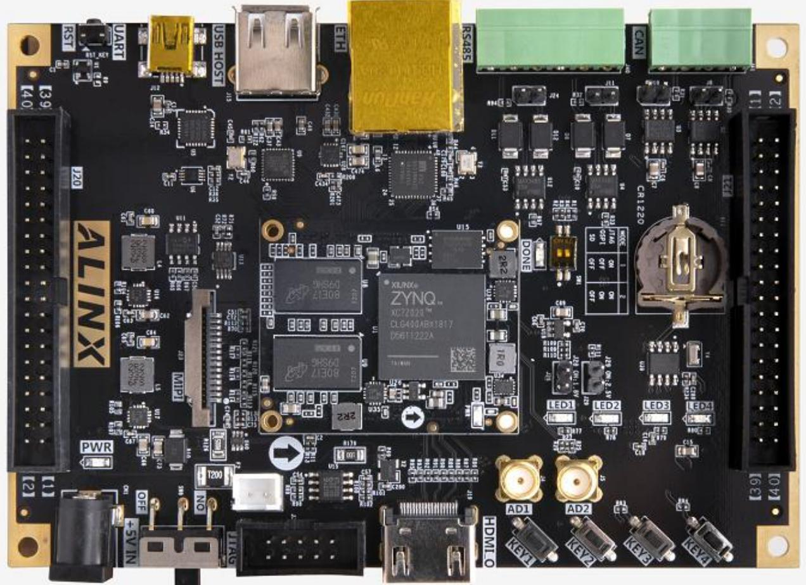

# 实验1：认识ZYNQ7020开发板

ZYNQ7020 是赛灵思（Xilinx）公司推出的一款集成了ARM Cortex-A9双核处理器和FPGA的可编程SoC（System on Chip）。它将处理系统的灵活性与FPGA的可编程逻辑相结合，广泛应用于嵌入式系统、工业控制、通信和消费电子等领域。

## 主要特性

### 1. **处理系统 (PS)**

- **ARM Cortex-A9 双核处理器**：最高运行频率可达766MHz，支持对称多处理（SMP）和非对称多处理（AMP）。
- **内存接口**：支持DDR3、DDR2、LPDDR2等内存类型。
- **外设接口**：包括USB 2.0、千兆以太网、CAN、SPI、I2C、UART等。
- **操作系统支持**：支持Linux、FreeRTOS等操作系统。

### 2. **可编程逻辑 (PL)**

- **逻辑单元**：ZYNQ7020包含85,000个逻辑单元，适合实现复杂的数字逻辑功能。
- **DSP 切片**：包含220个DSP切片，适合高性能信号处理应用。
- **Block RAM**：提供4.9Mb的块RAM，用于数据存储和高速缓存。
- **IO接口**：支持多种IO标准，包括LVDS、LVCMOS等。

### 3. **互联架构**

- **AXI 总线**：PS和PL之间通过AXI接口进行高速数据传输，支持多种AXI协议。
- **DMA 控制器**：支持高效的数据传输，减少CPU的负载。

### 4. **开发工具**

- **Vivado Design Suite**：赛灵思提供的集成开发环境，支持从设计到调试的全流程开发。
- **SDK（Software Development Kit）**：用于开发基于ARM处理器的软件应用。

## 应用场景

- **嵌入式系统**：ZYNQ7020广泛应用于嵌入式系统，如工业自动化、智能家居等。
- **通信设备**：由于其高性能处理能力，常用于通信基站、路由器等设备。
- **图像处理**：FPGA部分适用于实时图像处理，如视频监控、医疗影像等。

## 参考资料

- [Xilinx ZYNQ-7000 产品页面](https://www.xilinx.com/products/silicon-devices/soc/zynq-7000.html)
- [Vivado Design Suite 用户指南](https://www.xilinx.com/support/documentation/sw_manuals/vivado2021.1/ug910-vivado-getting-started.pdf)

通过以上介绍，您应该对ZYNQ7020有了一个初步的了解。如需更深入的学习和应用，建议参考官方文档和开发工具。

## AX7Z020 开发板

芯驿电子科技（上海）有限公司正式推出基于Xilinx Zynq-7000 SoC架构的AX7Z020专业级开发平台（2019版）。本手册旨在帮助开发者快速掌握该平台的技术特性与功能优势。

### 系统架构

#### 模块化设计

采用核心板+扩展板架构，支持快速二次开发：
- **核心板**：集成XC7Z020 SoC芯片（ARM+FPGA）
  - 双核ARM Cortex-A9处理器系统（PS）
  - 可编程逻辑单元（PL）
  - 存储配置：1GB DDR3（32位总线） + 256Mb QSPI Flash
  - 33.333MHz精密时钟源
- **扩展板**：提供丰富工业级接口



### 核心功能特性

#### 通信接口

- **高速网络**：10/100/1000Mbps以太网（KSZ9031 PHY芯片）
- **工业总线**：
  - 2×CAN总线（SN65HVD232收发器）
  - 2×RS485接口（MAX3485芯片）
- **无线扩展**：蓝牙/WiFi模块接口

#### 多媒体与存储

- HDMI 1.4a输出（1080P@60fps）
- USB 2.0 Host（外设扩展）
- Micro SD卡槽（系统镜像存储）
- MIPI CSI-2摄像头接口（支持OV5640模组）

#### 开发调试

- USB-UART调试接口（CP2102GM芯片）
- JTAG调试端口
- 板载状态指示：
  - 6个核心板LED（含电源/DONE指示灯）
  - 4个用户可编程LED
  - 4个功能按键

### 扩展能力

#### 模拟采集

- 双通道XADC输入
  - 0-10V模拟量输入范围
  - SMA标准接口

#### 扩展接口

- 2×40pin GPIO扩展口
  - 包含5V/3.3V供电
  - 34路可编程I/O
  - 支持外接模块：
    - 高速AD/DA模块
    - TFT-LCD显示屏
    - 双目摄像头

#### 环境监测

- LM75温度传感器
- I²C EEPROM（24LC04）

#### 应用

本开发平台适用于：

1. 工业控制系统开发
2. 高速以太网通信验证
3. 机器视觉与视频处理
4. 边缘计算原型设计
5. 嵌入式教学与科研



### 技术参数

| 类别        | 规格说明                     |
|-------------|----------------------------|
| SoC芯片      | XC7Z020-2CLG400I          |
| 存储容量     | DDR3 1GB + QSPI 256Mb     |
| 工作温度     | 工业级 -40℃ ~ +85℃        |
| 供电要求     | 5V/2A直流输入              |

本平台通过模块化设计与工业级硬件配置，为开发者提供从原型验证到产品部署的全流程支持，是Zynq-7000系列开发的理想选择。

## 调试准备与串口通信指南

### 一、驱动安装流程

1. **驱动获取**
   - 访问路径：`软件/CP210x_Windows_Drivers.zip`
   - 解压后运行`CP210xVCPInstaller.exe`进行安装

2. **硬件连接验证**
   - 使用红色Type-A转Mini-USB线连接开发板J7接口与计算机
   - 设备管理器查看端口状态：
     ▸ 正常状态：显示`Silicon Labs CP210x USB to UART Bridge (COMx)`
     ▸ 异常处理：使用驱动人生/Driver Booster等工具自动修复

### 二、终端配置规范

| 工具类型 | 推荐方案 | 参数配置 |
|---------|----------|---------|
| **PuTTY** | 免安装版路径：`软件/putty.exe` | 
|          | Connection type: Serial | 
|          | Serial line: COM3（根据实际端口号） | 
|          | Speed: 115200 | 
| **TeraTerm** | 官方安装版 | 波特率容错率更高 |

### 三、硬件操作规范

1. **启动模式设置**
   - 确认BOOT跳线帽位于SD模式（出厂默认配置）
   - 插入预装系统的Micro SD卡（FAT32格式）

2. **电源时序管理**
3. 
   ```mermaid
   graph TD
   A[连接12V电源适配器] --> B[开启底板电源开关]
   B --> C{观察指示灯}
   C -->|核心板LED常亮| D[启动成功]
   C -->|无响应| E[检查供电线路]
   ```

### 四、系统交互说明

1. **串口终端登录**
   - 用户名：`root`
   - 密码：`root`（输入时无视觉反馈）
   - 首次登录建议：`passwd`修改默认密码

2. **图形界面接入**
   - HDMI输出自动加载Debian X11桌面环境
   - 显示设置：默认支持1920x1080@60Hz
   - 面板配置选择：建议保持GNOME默认布局

### 五、常见问题排查

- **驱动安装失败**：
  1. 禁用驱动程序强制签名（Win10/11）
  2. 尝试v6.7.4旧版本驱动

- **无串口响应**：
  1. 检查USB线材质量（推荐AWG24标准线）
  2. 测量J7接口5V供电（正常范围4.75-5.25V）

- **系统未启动**：
  1. 确认SW1电源开关处于"ON"位置
  2. 测量核心板1.0V/1.8V供电轨电压

> **工程实践提示**：建议在静电防护工作台操作，避免PL芯片静电损伤。当进行FPGA配置时，确保JTAG链路上无信号干扰。
